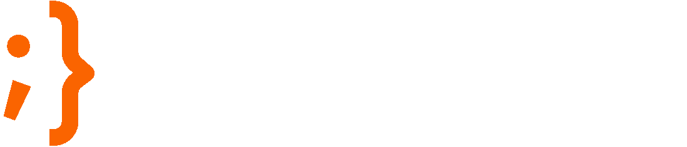

<a name="readme-top"></a>

<div align="center">
  
  <br/>

  <h2><b>oceanThreads</b></h2>
  <h4>Website Documentation</h4>

</div>

<!-- TABLE OF CONTENTS -->

# 📗 Table of Contents

- [📖 About the Project](#about-project)
  - [🌟 Key Features](#key-features)
  - [🚀 Live Demo](#live-demo)
  - [🛠 Tech Stack](#tech-stack)
- [💻 Getting Started](#getting-started)
  - [Prerequisites](#prerequisites)
  - [Download](#download)
  - [Install](#install)
- [👥 Team Members](#members)
- [📅 Future Features](#future-features)
- [🤝 Contributing](#contributing)
- [🫰 Show Support](#support)
- [🙏 Acknowledgements](#acknowledgements)
- [📝 License](#license)

<!-- PROJECT DESCRIPTION -->

# 📖 About the Project <a name="about-project"></a>

**oceanThreads** is a modern question-and-answer (Q&A) web app that is built different using web technologies for the students and instructors of General Assembly.

It is a kind of [Collective Intelligence (CI)](https://en.wikipedia.org/wiki/Collective_intelligence) solution which can be considered as an alternative to Artificial intelligence (AI) to provide students with an interactive, progressive and human-oriented learning journey. oceanThreads is inspired by other knowledge markets such as stackoverflow.com, quora.com, etc.

> “Now is no time to think of what you do not have. Think of what you can do with that there is.” ― Ernest Hemingway, The Old Man and the Sea

<p align="right">(<a href="#readme-top">back to top</a>)</p>

<!-- Key Features -->

## 🌟 Key Features <a name="key-features"></a>

- **[key_feature_1]**
- **[key_feature_2]**
- **[key_feature_3]**

<p align="right">(<a href="#readme-top">back to top</a>)</p>

<!-- Live Demo -->

## 🚀 Live Demo <a name="live-demo"></a>

- The web app is accessible from [this link](https://pages.git.generalassemb.ly/pirates-team/ocean-threads/).

<p align="right">(<a href="#readme-top">back to top</a>)</p>

<!-- Built With -->

## 🛠 Tech Stack <a name="tech-stack"></a>

<details>
  <summary>Client</summary>
  <ul>
    <li><a href="https://developer.mozilla.org/en-US/">HTML, CSS and JavaScript</a></li>
    <li><a href="https://getbootstrap.com/">Bootstrap Framework</a></li>
  </ul>
</details>

<details>
  <summary>Server</summary>
  <ul>
    <li><a href="https://nodejs.org/">Node.js</a></li>
    <li><a href="https://expressjs.com/">Express.js</a></li>
    <li><a href="https://www.passportjs.org/">Passport.js</a></li>
  </ul>
</details>

<details>
<summary>Database</summary>
  <ul>
    <li><a href="https://www.mongodb.com/">MongoDB Atlas</a></li>
    <li><a href="https://mongoosejs.com/">Mongoose ORM</a></li>
  </ul>
</details>

<!-- GETTING STARTED -->

## 💻 Getting Started <a name="getting-started"></a>

To get a local copy up and running, follow these steps.

### Prerequisites

In order to run this project you need the following tools (or newer versions):
- git v2.41.0
- npm v9.8.1
- Node.js v20.5.0
- Chrome v115.0
- VS Code v1.80.1

### Download

Clone this repository to your desired folder:

```sh
  git clone git@git.generalassemb.ly:pirates-team/ocean-threads.git
```

### Install

Touch an '.env' file and include the following keys: DATABASE_URL, GOOGLE_CLIENT_ID, GOOGLE_SECRET, GOOGLE_CALLBACK, and a random SECRET. After that, install this project with:

```sh
  cd ocean-threads
  npm install
  npm start
```

<p align="right">(<a href="#readme-top">back to top</a>)</p>

<!-- MEMBERS -->

## 👥 Team Members <a name="members"></a>

👤 **Ahmed Almadhoob** | [GitHub](https://git.generalassemb.ly/almadhoob/) - [LinkedIn](https://www.linkedin.com/in/almadhoob/)

👤 **Ali Haji** (Captain) | [GitHub](https://git.generalassemb.ly/ali-haji4/) - [LinkedIn](https://linkedin.com/in/ali--haji/)

👤 **Hamad Alhibshi** | [GitHub](https://git.generalassemb.ly/hamadalhibshi/) - [LinkedIn](https://linkedin.com/in/halhibshi/)

👤 **Rashid Althawadi** | [GitHub](https://git.generalassemb.ly/althawadi/) - [LinkedIn](https://linkedin.com/in/althawadi7/)

<p align="right">(<a href="#readme-top">back to top</a>)</p>

<!-- FUTURE FEATURES -->

## 📅 Future Features <a name="future-features"></a>

- [x] **[new_feature_1]**
- [ ] **[new_feature_2]**
- [ ] **[new_feature_3]**

<p align="right">(<a href="#readme-top">back to top</a>)</p>

<!-- CONTRIBUTING -->

## 🤝 Contributing <a name="contributing"></a>

Contributions, issues, and feature requests are welcome. Feel free to check the [issues page](https://git.generalassemb.ly/pirates-team/ocean-threads/issues/).

To create a new branch each time:
```sh
git checkout main
git pull origin main
git checkout -b yourNewBranch
```

To update an existing branch:
```sh
git checkout yourElderBranch
git pull origin main
```

To push your branch:
```sh
git add .
git commit -m "yourComment"
git push -u origin yourBranch
```

<p align="right">(<a href="#readme-top">back to top</a>)</p>

<!-- SUPPORT -->

## 🫰 Show Support <a name="support"></a>

If you like this project then support us by donations or buy a cup of coffee for each team member.

<p align="right">(<a href="#readme-top">back to top</a>)</p>

<!-- ACKNOWLEDGEMENTS -->

## 🙏 Acknowledgments <a name="acknowledgements"></a>

We would like to thank Tor Johnson, Avan Sardar, Ahlam Almutawa, Mohamed Faris and Ernest Hemingway.

<p align="right">(<a href="#readme-top">back to top</a>)</p>

<!-- LICENSE -->

## 📝 License <a name="license"></a>

This project is [MIT-licensed](./LICENSE).

<p align="right">(<a href="#readme-top">back to top</a>)</p>
